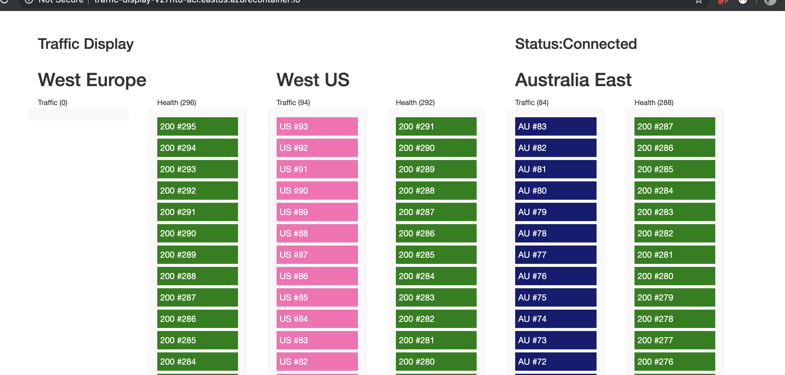

# Traffic Visualiser
Enable the visualisation of HTTP traffic across routing scenarios through the use of SignalR and three separate containers:

- [definedcontext/traffic-generator](https://cloud.docker.com/u/definedcontext/repository/docker/definedcontext/traffic-generator) to generate traffic for the endpoint.
- [definedcontext/traffic-endpoint](https://cloud.docker.com/u/definedcontext/repository/docker/definedcontext/traffic-endpoint) to process endpoint health checks and traffic flows.
- [definedcontext/traffic-display](https://cloud.docker.com/u/definedcontext/repository/docker/definedcontext/traffic-display) to provide the visual representation.

Below is a screenshot of the traffic display result.

### Azure Front Door
ARM template example demonstrating Azure Front Door routing within examples/azure-front-door directory. This template will create all the resources required to demonstrate routing features of Azure Front Door.

